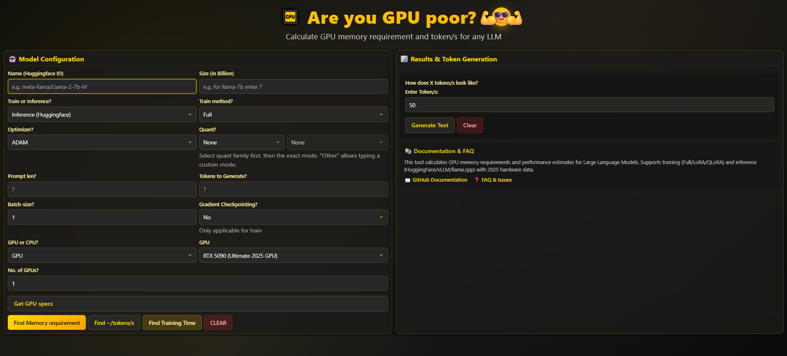

# Are you GPU poor? 💪😎💪 


**The most comprehensive GPU memory calculator and performance estimator for Large Language Models**

Calculate **GPU memory requirements** and estimate **token/s performance** for any LLM with advanced quantization support and real hardware specs.


*Main application interface with dual-panel layout*

## ✨ Key Features

🎯 **Smart Model Recommendations** - Always shows top models that fit your hardware, with GPU count estimates  
🔍 **Enhanced Autocomplete** - Combined user-friendly names + Hugging Face model IDs with keyboard navigation  
⚡ **Advanced Quantization** - Support for GGML (Q2-Q8), AWQ, NF4, bitsandbytes with accurate memory calculations  
🚀 **2025 Hardware Database** - RTX 50/40 series, H100, RX 7000 series, latest AMD/Intel CPUs  
🧠 **Comprehensive Models** - Llama 3.3, Qwen 2.5, DeepSeek V3, Mistral Large, and thousands more  
📊 **Real Memory Calculations** - Parameter memory + KV cache + overhead with quant-aware byte counting  


*Memory calculation results with detailed breakdown of components*

## What's New in 2025

🆕 **Smart Memory Calculator** - Never shows "no compatible models" - always provides recommendations with GPU count needed  
🔧 **Two-Level Quantization UI** - Select quant family (GGML/AWQ/NF4) then specific mode (Q4_K_M, Q2_K, etc.)  
🎨 **Improved UX** - Centered modals, copy specs button, visible suggestion highlighting  
💾 **Enhanced Data Sources** - Migrated to `src/data/` with 2025 hardware specs and user-friendly model names  
🧹 **Clean Architecture** - Removed legacy config files, streamlined folder structure  


*Hardware specifications modal with copy-to-clipboard functionality*

## How It Works

### Memory Calculation Formula
```javascript
// Parameter Memory (quant-aware)
parameterMemory = paramCount × bytesPerParam(quantMode)

// KV Cache Memory  
kvCacheMemory = contextLength × hiddenSize × numLayers × 2 × bytesPerParam

// Total Memory
totalMemory = (parameterMemory + kvCacheMemory) × overheadFactor
```

### Quantization Support
- **GGML**: Q2_K, Q3_K_S/M/L, Q4_0/1/K_S/M/L, Q5_0/1/K_M, Q6_K/L, Q8_0
- **AWQ**: Standard AWQ, AWQ-GS variants
- **NF4**: Neural Float 4-bit quantization
- **bitsandbytes**: int8, q4_0, q4_k_m modes
- **Custom**: Text input for other quantization schemes

## Core Features in Detail

### 🧮 Memory Requirement Calculator
- **Real-time calculations** for model parameter memory
- **KV cache estimation** based on context length and batch size
- **Quantization-aware** byte counting for accurate results
- **Multi-GPU support** with automatic GPU count recommendations

### ⚡ Token Performance Estimator
- **Tokens per second** calculation based on hardware specs
- **Time to generate** estimates for prompt processing
- **Memory vs compute bound** analysis
- **Real-time text generation** demonstration


*Token performance results showing detailed speed metrics and generation estimates*

### 🏋️ Training Time Calculator
- **Forward + backward pass** timing estimates
- **Gradient checkpointing** impact analysis
- **Optimizer comparison** (Adam, AdamW, SGD)
- **LoRA vs full training** performance differences


*Training performance analysis with iteration timing and memory requirements*

### 🎯 Smart Text Generation Demo
- **Visual token generation** at calculated speeds
- **Customizable token count** for demonstration
- **Real-time typing effect** matching performance estimates
- **Interactive speed visualization**


*Live text generation demo showing tokens/second in action*

## Example Results

### Memory Requirements
```json
{
  "meta-llama/Llama-2-7b-hf": "13.50 GB — GPUs: 1",
  "mistralai/Mistral-7B-v0.1": "13.48 GB — GPUs: 1", 
  "Qwen/Qwen2-7B": "13.45 GB — GPUs: 1",
  "microsoft/DialoGPT-large": "1.47 GB — GPUs: 1",
  "microsoft/DialoGPT-medium": "0.73 GB — GPUs: 1"
}
```

### Hardware Specs Modal
```
GPU ID: rtx-4090
Name: RTX 4090 (Previous Gen Beast)
Architecture: Ada Lovelace
Compute (TFLOPS): 83.0
Memory (GB): 24
Memory Bandwidth (GB/s): 1008
TDP (W): 450
Release Year: 2022
Selected quant: ggml_Q4_K_M
```

## Supported Hardware & Models

### 2025 GPU Database
- **RTX 50 Series**: 5090 (32GB), 5080 (16GB), 5070 Ti (16GB), 5070 (12GB)
- **RTX 40 Series**: All variants including Super models and RTX 4050
- **RTX 30/20 Series**: Complete lineup including RTX 2060, 2070, 2080 variants
- **Professional**: H100, A100 80GB, RTX 6000 Ada, A6000, P40, P100
- **AMD RDNA3**: RX 7900 XTX/XT, 7800 XT, 7700 XT, 7600 XT/non-XT
- **Legacy**: GTX 1660, GTX 1650, GTX 1070, GTX 1080 Ti support

### 2025 CPU Database  
- **AMD Zen 5**: Ryzen 9950X, 9900X, 9800X3D (display names included)
- **AMD Zen 4**: 7950X and earlier generations
- **Intel 14th Gen**: Core i9-14900K, i7-13700K, i5-12700H variants
- **Intel Legacy**: 9900K and Coffee Lake support
- **AMD HEDT**: Threadripper 3990X (64-core) support

### AI Models (3000+)
- **Meta**: Llama 3.3, Llama 2, Code Llama (all sizes)
- **Alibaba**: Qwen 2.5 series (0.5B to 72B parameters)  
- **Mistral**: Large 24.11, Mixtral 8x22B, 7B variants
- **Microsoft**: Phi-4, Phi-3.5, DialoGPT series
- **Google**: Gemma 2 series, various sizes
- **DeepSeek**: V3, Coder V2, all parameter counts
- **User-Friendly**: Curated list with display names for popular models

## User Interface Highlights

### 🎨 Modern Design
- **Dual-panel layout** for efficient workflow
- **Dark theme** optimized for extended use
- **Responsive design** works on all screen sizes
- **Intuitive icons** and clear labeling

### 🔧 Advanced Controls
- **Dropdown cascading** for quantization selection
- **Real-time validation** of input parameters
- **Keyboard shortcuts** for power users
- **Copy-to-clipboard** functionality

### 📊 Rich Results Display
- **Tabular breakdowns** of memory components
- **Visual performance metrics** with clear units
- **Interactive modals** for detailed specifications
- **Export-friendly** data formats

## FAQ

### Why does it always show results now?
The calculator provides recommendations even when models exceed your GPU memory by showing how many GPUs would be needed. This gives practical insights for scaling or choosing alternative hardware.

### How accurate are the memory calculations?
- **Parameter Memory**: Quant-aware calculations (fp16=2 bytes, q4=0.5 bytes, etc.)
- **KV Cache**: Conservative estimate based on context length and model architecture  
- **Overhead**: 5% multiplicative factor for framework/driver overhead
- **Typical Accuracy**: Within 10-15% of actual memory usage

### What quantization modes are supported?
- **GGML**: Full Q2-Q8 range with all K-variants (Q4_K_M, Q3_K_S, etc.)
- **AWQ**: Standard and GS variants for 4-bit weights
- **NF4**: Neural Float 4-bit for optimal quality/size ratio
- **bitsandbytes**: int8 and 4-bit variants with different precisions
- **Custom**: Text input for proprietary or new quantization schemes

### How do I use the autocomplete?
1. Start typing a model name (e.g., "llama", "qwen", "mistral")
2. Use arrow keys to navigate suggestions
3. Press Enter to select, or keep typing for custom Hugging Face IDs
4. Supports both technical IDs and user-friendly names

### What's the difference from the old version?
- **Always shows results**: No more "no compatible models" messages
- **Better quantization**: Two-level selection (family → mode) with accurate byte counting
- **Improved data**: 2025 hardware specs, cleaned config structure
- **Enhanced UX**: Centered modals, copy buttons, keyboard navigation

## Development

```bash
# Install dependencies
npm install

# Start development server  
npm start
# Opens http://localhost:3000/gpu_poor

# Build for production
npm run build

# Test production build locally
npx serve -s build
```

### Project Structure
```
src/
├── data/                    # JSON databases (2025 data)
│   ├── gpu_database_2025.json
│   ├── cpu_database_2025.json  
│   ├── model_database_2025.json
│   └── user_friendly_models_2025.json
├── services/               # Core calculation logic
│   └── dataManager.js     # Memory estimation & recommendations
├── components/            # Reusable UI components
│   └── TextInput.js      # Enhanced input with autocomplete
└── styles/               # CSS styling
    └── App.css          # Main application styles

images/                    # Documentation images
├── app-interface.png     # Main UI overview
├── model-selection.png   # Autocomplete feature
├── hardware-specs.png    # Hardware modal
├── quantization-options.png  # Quant selection
├── memory-results.png    # Memory calculations
├── token-performance.png # Performance results
├── training-results.png  # Training analysis
├── text-generation.png   # Text demo
├── configuration-panel.png  # Config options
└── app-overview.png      # Complete overview

archive/                   # Archived legacy config files
├── removed_docs_*/       # Old generated docs
└── removed_config_*/     # Legacy src/config files
```

### Key Changes (2025 Update)
- ✅ Migrated to `src/data/` structure from legacy configs
- ✅ Added comprehensive GGML quantization support  
- ✅ Implemented smart memory calculator that always shows results
- ✅ Enhanced autocomplete with user-friendly model names
- ✅ Added RTX 4050, RTX 2060 series, and 2025 CPU display names
- ✅ Cleaned folder structure (archived old config files)
- ✅ Real-time text generation demonstration
- ✅ Interactive token performance visualization
- ✅ Advanced training time calculations
- ✅ Copy-to-clipboard hardware specifications
- ✅ Responsive design with modern UI components

## Technical Implementation

### Memory Calculation Engine
The core `dataManager.js` service provides:
- **Quantization-aware byte counting** for accurate memory estimates
- **Model architecture detection** from Hugging Face model IDs
- **Hardware performance mapping** from comprehensive databases
- **Multi-mode support** for inference, training, and LoRA fine-tuning

### User Experience Enhancements
- **Smart autocomplete** with fuzzy matching and keyboard navigation
- **Progressive disclosure** of advanced options
- **Real-time validation** with helpful error messages
- **Contextual help** and documentation links

### Data Management
- **Comprehensive databases** with 2025 hardware specifications
- **User-friendly mappings** for popular model names
- **Extensible architecture** for easy updates and additions
- **Performance optimization** with memoization and caching

---

**Built with React • Enhanced for 2025 • Always shows results 💪😎💪**

*Made with ❤️ for the AI community - helping developers make informed hardware decisions*

## Acknowledgments

**Special thanks to [Rahul Chand](https://github.com/rahulschand) - the original project owner and creator of this GPU memory calculator. This enhanced version builds upon his foundational work and vision for helping the AI community make informed hardware decisions.**

🙏 *Original project inspiration and core concepts by Rahul Chand*
